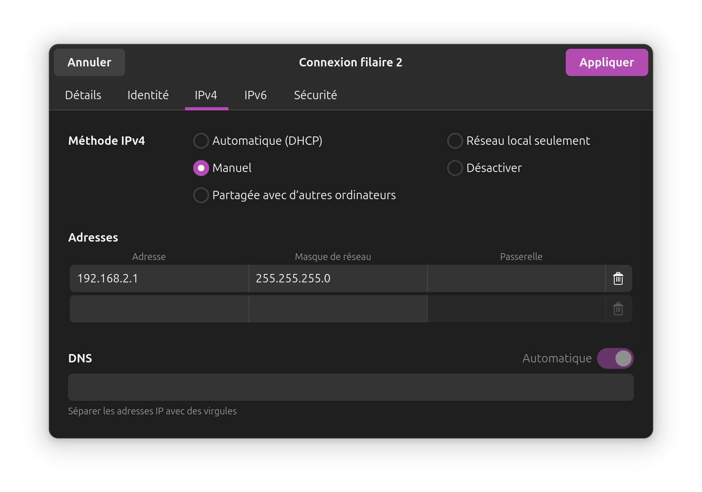
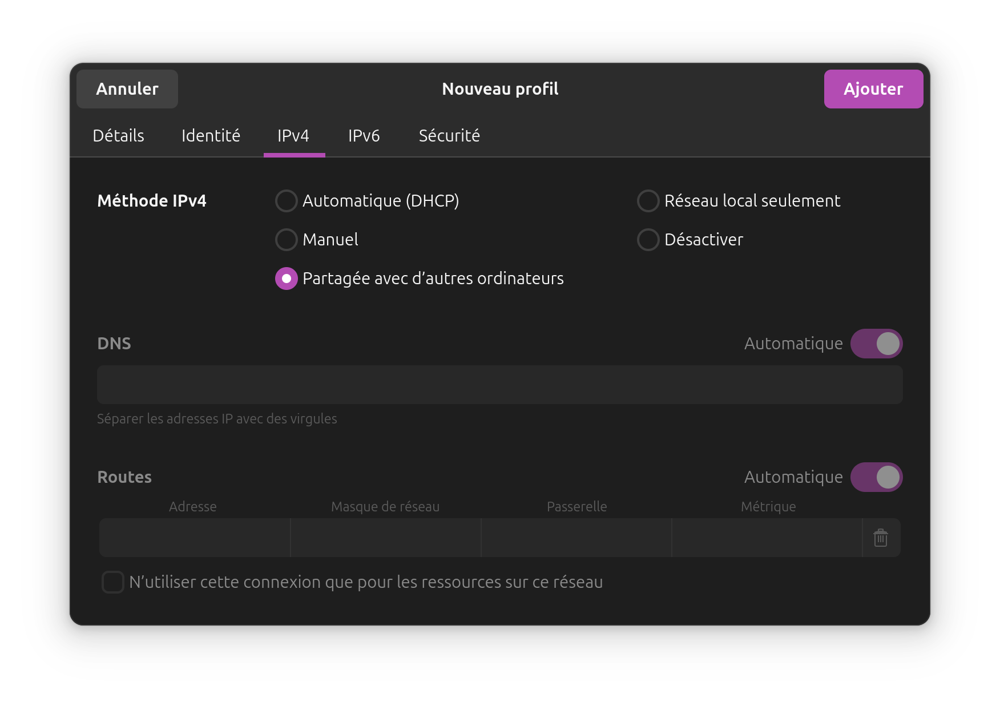

# Instructions to Configure a Router

## Introduction

The methods for configuring a router vary depending on the default version installed on the device. Please follow the instructions corresponding to the versions below.


## From Factory Version

The simplest method in this case is using the TP-Link web interface, which will subsequently allow us to flash the router and easily change its firmware.

### Step 1: Verify Connection to the Same Network

By default, the router's IP address is `192.168.0.254`.  
Go to your network configuration settings and set your computer's IP address to one in the same subnet, such as `192.168.0.2/24`, to access the router.

> **Note:**  
> Feel free to use Wireshark to monitor the network interface in question to verify the router's IP address and adjust your computer's IP address accordingly.  
> Additionally, you can use the command `nmap -sn [your subnet IP range with netmask]` to scan for available devices on the network.

<div align="center">
<br>
 </br>
Wireshark  
</br>
</div>

<div align="center">
<br>
 </br>
Network Configuration   
</br>
</div>


### Step 2: Web Interface
<div align="center">
<br>
 </br>
WEB Interface  
</br>
</div>

Access the router via your favorite browser using `https://tplinkeap.net` or `http://192.168.0.254`. The default credentials are `admin/admin`.  
For added convenience and security, the next page will prompt you to set a new username/password. We'll use `theseus` and `theseus-2023` in this example.

<div align="center">
<br>
 </br>
WEB Interface | Enable SSH Connection  
</br>
</div>

Next, navigate to the **Management** tab, then **SSH**, and enable the `SSH Login` option.

<div align="center">
<br>
 </br>
WEB Interface | Flash Firmware  
</br>
</div>

Finally, go to the **System** tab, then **Update Firmware**, and upload the new firmware file.  
Use this file: [Firmware for Factory](Firmwares/openwrt-23.05.5-0d92fd07ec16-ath79-generic-tplink_eap225-outdoor-v3-squashfs-factory.bin) *(Not tested yet but expected to work) => Don't work*.  

For the moment, we just erase one package and add wpad-mesh-openssl. The idea is to put also a bash script to directly configure the router.

> **Note:**  
> After the process is completed, you will be disconnected, and the new **Luci interface** will open at the same IP address. It may take some time for the router to finish updating, so please be patient.

The router is now ready to use with all necessary packages installed.

### Bonus Step: Configure DHCP

Log in via SSH to the router's IP address (you may need to search for the correct IP, as it may not always be the same):

```sh
ssh root@192.168.1.1
``` 

```sh
uci set network.lan.proto="dhcp"
uci commit network
/etc/init.d/network restart
```

You will also need to modify your network configuration so the router can interact with the DHCP server. In some cases, you may need to configure your computer as a proxy in the network settings.

<div align="center">
<br>
 </br>
Network Configuration DHCP  
</br>
</div>

## From OpenWRT Snapshot Version

The snapshot version is unstable and often causes issues during updates, as package files tend to change frequently.

### Step 1: Connection with 
*(Details to be added)*

### Step 2:
*(Details to be added)*

### Step 3:
*(Details to be added)*

### Step 4:
*(Details to be added)*


## To be rewrite

Expliquer comment se connecter à un routeur (changement d'IP) et tout
Trouver l'ip du routeur:
faire un nmap 192.168.1.2/24
Une fois l'ip trouver se connecter en ssh root@<ipaddress>
faire les commandes:
* uci set network.lan.proto="dhcp"
* uci commit network
* /etc/init.d/network restart

Se connecter au router
Trouver l'ip du routeur:
faire un nmap 192.168.1.2/24

Comment mettre le routeur dans la configuration qu'on souhaite

Flasher le router pour le mettre à jour avec la version stable:

SI Factory 
Passer par l'image facotry

SI Openwirt 
Passer par l'image openw
Dans l'image
ajouter les deux commandes, -basic et +autre commande
ajouter une partie config de mdp

ajouter script pour prédéfinir les adresse ipv4, passer en ipv6?

Créer nouvelle interface DHCP pour config dhcp, et nouvelle config static pour ipv4 (attention à la priorité des interfaces)
