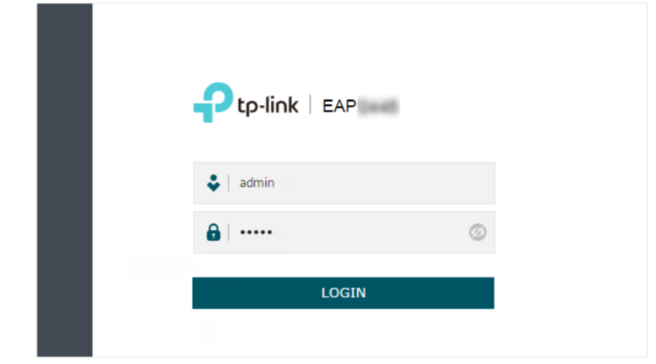
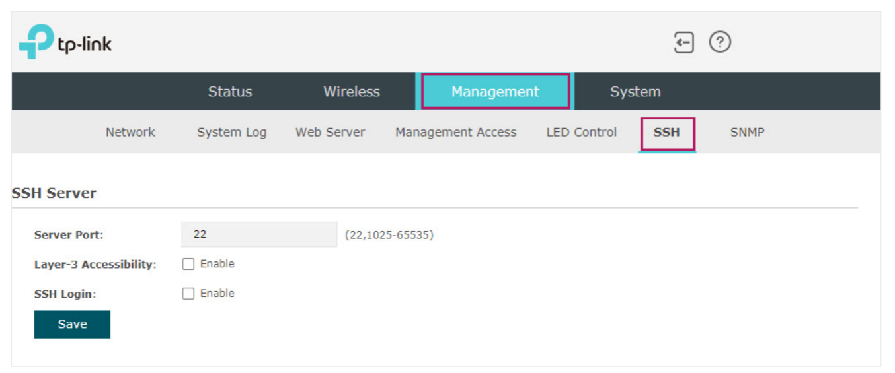
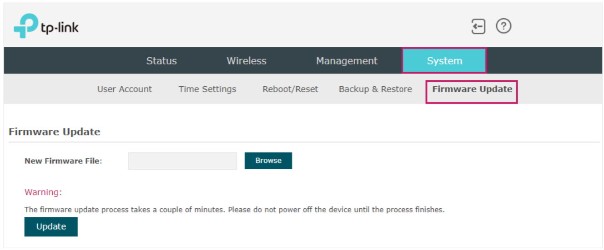

#  Instructions pour configurer un routeur:

## Introduction

Les méthodes pour configurer le routeur varie selon la version installée par défaut sur le routeur. Merci de suivre les instructions suivants les versions ci dessous.
## Depuis Version Factory

La méthode la plus simple dans ce cas est par l'interface web de TP-Link qui nous permettra par la suite de flasher le routeur et de changer facilement le firmware

### Etape 1: Vérifier sa connexion dans le même réseau

Par défaut, le routeur a pour adresse IP `192.168.1.1`.  
Allez dans la configuration de votre réseau puis régler l'adresse IP de votre ordinateur dans ce sous-réseau comme par exemple `192.168.1.2/24` vous permettant de voir le routeur.

> Remarque:  
N'hésitez pas à regarder sur Wireshark l'interface du réseau en question afin de vérfier l'adresse IP du routeur pour adapter notre adresse IP dans réseau en conséquence. 

N'hésitez pas non plus à utilser la commande `nmap -sn [votre IP dans le sous réseau]`pour faire une reconnaissance des appareils disponibles.


### Etape 2: Interface web
<div align="center">
<br>
 </br>
Interface WEB </br>
</br> 
</div>

La connexion s'effectue par votre navigateur favori : `https://tplinkeap.net` or `192.168.1.1`. Les identifiants par défaut sont admin/admin. Pour plus da facilité et de sécurité, la page suivante vous demadera de choisir un nouveau couple identifiant/mot de passe. Nous prendrons `theseus`et `theseus-2023`.

<div align="center">
<br>
 </br>
Interface WEB | Activer SSH connexion </br>
</br> 
</div>

Vous devez ensuite aller dans l'onglet management puis SSH et cocher la case `SSH Login`. 

<div align="center">
<br>
 </br>
Interface WEB | Flash Fimware </br>
</br> 
</div>

Enfin, il faut aller dans l'onglet System puis Update Firmware et récupérer le fichier pour flash le nouveau firmware. 
Le fichier en question est celui ci: [Firmware pour Factory](Firmwares/openwrt-23.05.5-0d92fd07ec16-ath79-generic-tplink_eap225-outdoor-v3-squashfs-factory.bin )

il a été géneré avec le script suivant:

```sh

PASSWORD="theseus-2023"

# Configure default entry points
MESH_NAME="THESEUS"
MESH_PWD=$PASSWORD
MESH_RADIO=radio1
MESH_CHANNEL=1

MESH5_NAME="THESEUS"
MESH5_PWD=$PASSWORD
MESH5_RADIO=radio0
MESH5_CHANNEL=36


WIFI_NAME="RABBIT"
WIFI_PWD=$PASSWORD
WIFI_RADIO=radio1
WIFI_CHANNEL=10
WIFI_MOBDOMAIN='2222'

WIFI5_NAME="RABBIT5"
WIFI5_PWD=$PASSWORD
WIFI5_RADIO=radio0
WIFI5_CHANNEL=36
WIFI5_MOBDOMAIN='2222'

# Change Password
var=`grep  '^root:' /etc/shadow | cut -d: -f2 `
if [ "$var " == " " ]
then
(
         echo $PASSWORD
         sleep 1
         echo $PASSWORD
)|passwd root
fi
````

> Remarque:  
Vous serez déconnecté à la fin du processus et la nouvelle interface Luci s'ouvrira à la même adresse IP. Il est peut être necéssaire d'attendre pour laisser du temps au routeur de se mettre à jour.

Le routeur est maintenant prêt à être utilisé avec tous les paquets installés.
### Etape bonus: Configurer en DHCP

Connectez vous en SSH à l'adresse IP (la rechercher si besoin, ce n'est pas nécessairement celle-ci): 

```sh
ssh root@192.168.1.1
``` 

```sh
uci set network.lan.proto="dhcp"
uci commit network
/etc/init.d/network restart
```

Il faut aussi modifier sa configuration réseau pour que le routeur puisse interargir avec le serveur DHCP. Il est possible de passer son ordinateur en proxy dans les configurations


## Depuis Version Openwirt Snapshot

Cette version étant instable, elle pose pas mal de problèmes pour la mise à jour comme les fichiers de package ont tendance à changer souvent.

### Etape 1: 


## To be rewrite


```sh
ssh root@192.168.1.1
```
Expliquer comment se connecter à un routeur (changement d'IP) et tout
Trouver l'ip du routeur:
faire un nmap 192.168.1.2/24
Une fois l'ip trouver se connecter en ssh root@<ipaddress>
faire les commandes:
* uci set network.lan.proto="dhcp"
* uci commit network
* /etc/init.d/network restart

Se connecter au router
Trouver l'ip du routeur:
faire un nmap 192.168.1.2/24

Comment mettre le routeur dans la configuration qu'on souhaite

Flasher le router pour le mettre à jour avec la version stable:

SI Factory 
Passer par l'image facotry

SI Openwirt 
Passer par l'image openw
Dans l'image
ajouter les deux commandes, -basic et +autre commande
ajouter une partie config de mdp

ajouter script pour prédéfinir les adresse ipv4, passer en ipv6?

Créer nouvelle interface DHCP pour config dhcp, et nouvelle config static pour ipv4 (attention à la priorité des interfaces)
